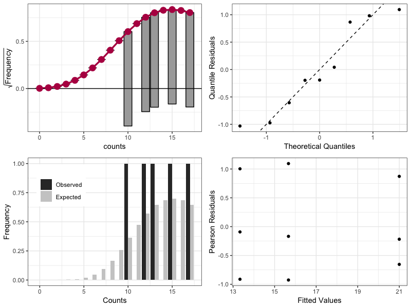

# Count Model Diagnostics

## Introduction

This repository introduces `autoplot.countreg.R` function for `R`. It uses resources from package `countreg` to create diagnostics plots for count data regression models. Four plots are created in order to check the model assumptions: rootogram, QQ plot, expected and observed values, and Pearson Residuals versus Fitted Values. All the plots are created using `ggplot2`, which gives them a similar look and feel.

`autoplot.countreg.R` function depends on `countreg`, `ggplot2`, and `gridExtra` packages.

## Usage

Save `autoplot.countreg.R` in the same folder where is your analysis code. Run `source(autoplot.countreg.R)` to load the function and the needed packages in your environment. 

The folloing code shows how you can check the residuals of a Poisson regression.

    source(autoplot.countreg.R)
    library(MASS)
    
    # example from MASS::glm
    
    counts <- c(18,17,15,20,10,20,25,13,12)
    outcome <- gl(3,1,9)
    treatment <- gl(3,3)
    print(d.AD <- data.frame(treatment, outcome, counts))
    glm.D93 <- glm(counts ~ outcome + treatment, family = "poisson")
    
    autoplot.countreg(glm.D93)
    

Analogue codes will work with functions `glm.nb`, `hurdle`, and `zeroinfl`.

## References

Kleiber, C. and Zeileis, A. (2016), "Visualizing Count Data Regressions Using Rootograms", _The American Statistician_, **70** (6) 296-303. URL: [https://www.tandfonline.com/doi/ref/10.1080/00031305.2016.1173590](https://www.tandfonline.com/doi/ref/10.1080/00031305.2016.1173590)
