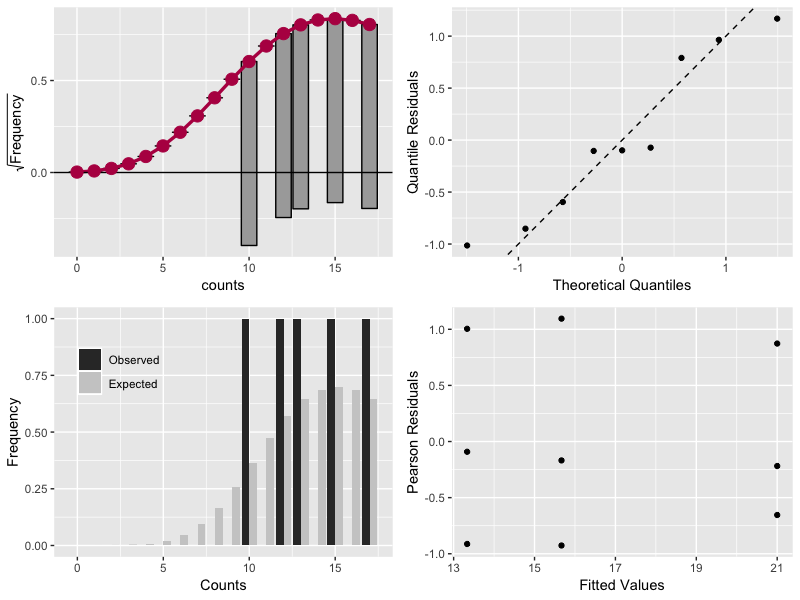

# Count Model Diagnostics

## Introduction

The function `autoplot.countreg.R` uses some functions from package `countreg` to create diagnostics plots for count models. Four plots are created in order to check the model assumptions. `ggplot2` is used to make the plots have a similar look and feel.

Therefore, `autoplot.countreg.R` function depends on both `countreg` and `ggplot2` packages.

## Usage

Download `autoplot.countreg.R` and put it in the same folder your analysis is. Run `source(autoplot.countreg.R)` to load the function and the packages needed in your environment. 

Run the code below to make a reproducible example.

    source(autoplot.countreg.R)
    library(MASS)
    
    # example from MASS::glm
    
    counts <- c(18,17,15,20,10,20,25,13,12)
    outcome <- gl(3,1,9)
    treatment <- gl(3,3)
    print(d.AD <- data.frame(treatment, outcome, counts))
    glm.D93 <- glm(counts ~ outcome + treatment, family = "poisson")
    
    autoplot.countreg(glm.D93)
    

## References

Kleiber, C. and Zeileis, A. (2016), "Visualizing Count Data Regressions Using Rootograms", _The American Statistician_, **70** (6) 296-303. URL: [https://www.tandfonline.com/doi/ref/10.1080/00031305.2016.1173590?scroll=top](https://www.tandfonline.com/doi/ref/10.1080/00031305.2016.1173590?scroll=top)